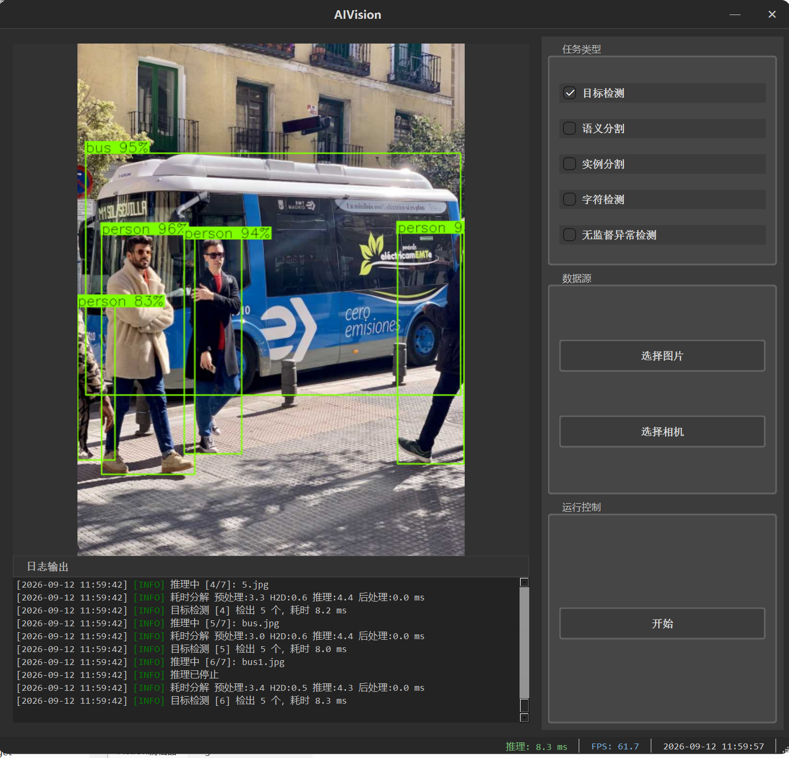
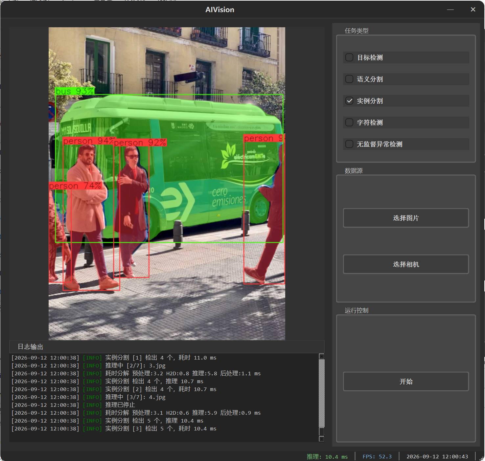
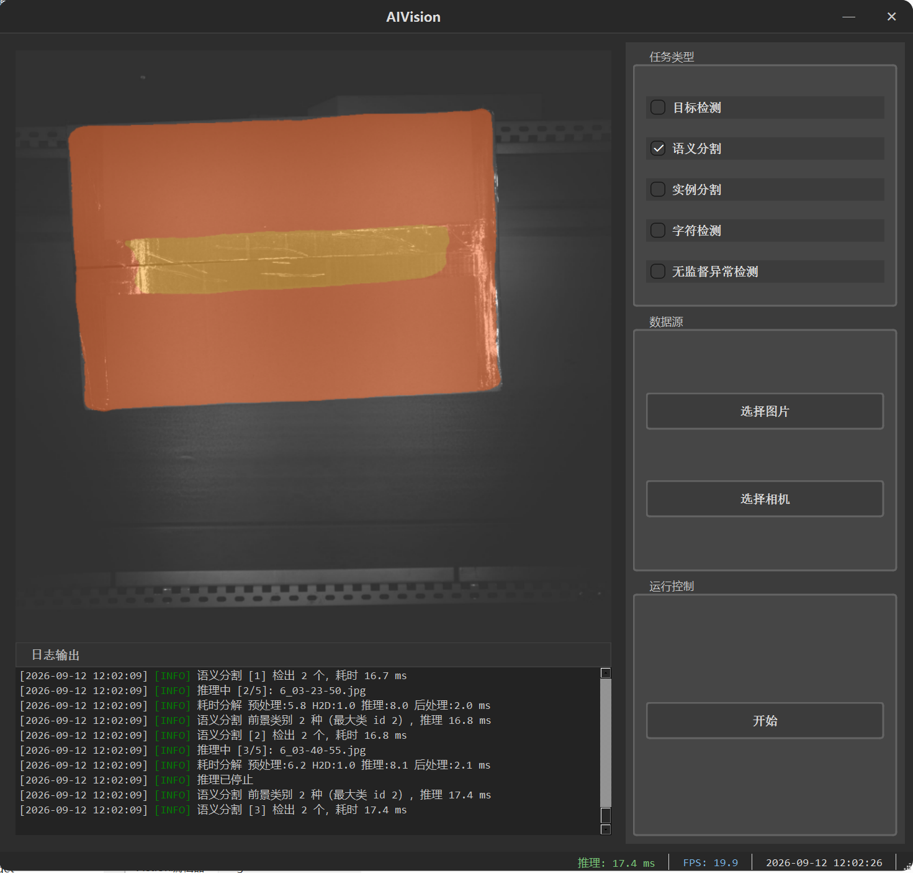
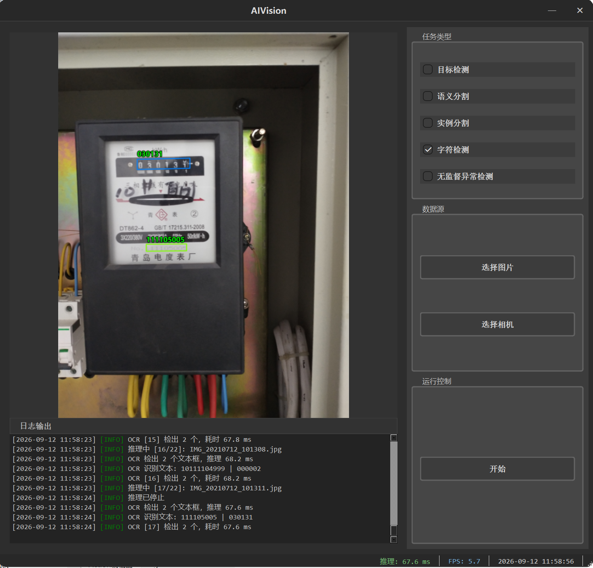

<div align="center">

# DetectAnything

**基于 Qt 6 + TensorRT 的桌面端多任务 AI 视觉推理部署演示**

一个把「通用 TensorRT 推理引擎」与「具体任务的预处理 / 后处理 / 绘制」彻底解耦的
多线程桌面推理框架，已落地 **目标检测**、**实例分割**、**语义分割**、**OCR** 四类任务。


</div>

---

## 目录

- [简介](#简介)
- [功能特性](#功能特性)
- [界面预览](#界面预览)
- [技术栈](#技术栈)
- [系统架构](#系统架构)
- [目录结构](#目录结构)
- [模型说明](#模型说明)
- [环境依赖](#环境依赖)
- [编译构建](#编译构建)
- [生成 TensorRT 引擎](#生成-tensorrt-引擎)
- [使用方法](#使用方法)
- [性能参考](#性能参考)
- [扩展新任务](#扩展新任务)
- [注意事项](#注意事项)
- [许可证](#许可证)

---

## 简介

**DetectAnything2** 是一个基于 **Qt Widgets + TensorRT** 的 Windows 桌面端多任务计算机视觉推理演示程序。

它的核心设计目标是「**通用引擎 + 任务插件化**」：

- 与任务无关的推理管线（反序列化 engine、显存 / 锁页内存管理、`enqueueV3`、预热、分段计时）被封装进通用的 `TrtEngine`；
- 每个具体任务（检测 / 分割 / OCR）只需实现 `ITask` 接口，编写自己专属的**预处理、后处理、绘制**三段逻辑；
- `TaskFactory` 作为唯一的组合根按任务类型创建实例，UI 与推理线程完全不感知具体任务，仅依赖 `itask.h`。

因此**新增一个任务的成本极低**：建一个子目录、写一个 `ITask` 派生类、在工厂登记一行、在 `.pro` 添加源文件即可，框架代码零改动。

## 功能特性

### 已支持的推理任务

| 任务类型 | 模型 | 状态 | 渲染输出 |
|---------|------|:----:|---------|
| 目标检测 Detection | YOLO26m | ✅ 已实现 | 检测框 + `类别 置信度` 标签（COCO 80 类） |
| 实例分割 Instance Segmentation | YOLO26m-seg | ✅ 已实现 | 半透明彩色掩膜 + 检测框 + 标签 |
| 文字识别 OCR | PPOCR (det + rec) | ✅ 已实现 | 文本框 + 识别文字（微软雅黑中文渲染） |
| 语义分割 Semantic Segmentation | PaddleSeg (model_sim) | ✅ 已实现 | 半透明彩色类别掩膜叠加原图 |
| 无监督异常检测 Anomaly Detection | — | 🚧 占位 | 工厂返回 `nullptr`，UI 记「未实现」 |

### 应用能力

- 🎨 **无边框深色主题窗口**：自定义标题栏（最小化 / 关闭），支持鼠标拖拽移动。
- 🧵 **生产者 - 消费者多线程**：图像读取与推理运行在独立子线程，UI 全程不阻塞；推理中自动锁定任务切换。
- 📊 **实时状态显示**：推理耗时（ms）、真实帧率（FPS）、系统时钟。
- 📝 **内置日志面板**：线程安全单例日志，实时输出任务切换、耗时分解、检出数量等。
- 🔁 **任务热切换**：5 种任务类型互斥单选，勾选即通过工厂创建并注入推理线程。
- 🖼️ **图像文件夹批处理**：选择目录后自动扫描 jpg/png/bmp/tif 等图片并逐帧推理。
- 🈶 **中文本地化**：内置 `DetectAnything_zh_CN.ts` 翻译，OCR 结果用 `QPainter` 正确渲染中文。

## 界面预览

深色无边框主界面：**左侧**为推理结果画布 + 实时日志面板，**右侧**自上而下为「任务类型 / 数据源 / 运行控制」三区，**底部状态栏**实时显示推理耗时(ms)、真实帧率(FPS) 与系统时钟。以下为四类已实现任务的实测运行截图：

| 目标检测 Detection | 实例分割 Instance Segmentation |
|:---:|:---:|
|  |  |

| 语义分割 Semantic Segmentation | 文字识别 OCR |
|:---:|:---:|
|  |  |

## 技术栈

| 组件 | 版本 | 用途 |
|------|------|------|
| **Qt Widgets** | 6.9.3 (MSVC2022 64-bit) | GUI 框架、多线程、信号槽、国际化 |
| **OpenCV** | 4.8.0 (`opencv_world480`) | 图像预处理、绘制、`blobFromImage` |
| **TensorRT** | 8.6.1.6 | 高性能深度学习推理引擎 |
| **CUDA** | 11.8 | GPU 计算与显存 / 锁页内存管理 |
| **C++ 标准** | C++17 | — |
| **构建系统** | qmake | 单工程构建 |

## 系统架构

采用**分层 + 任务插件化**设计，推理线程与 UI 仅依赖抽象接口 `itask.h`：

```
┌───────────────────────────────────────────────────────────────┐
│  MainWindow (UI 主线程)                                          │
│   · 任务勾选 → TaskFactory::create() 创建任务并 init()           │
│   · 选择图片文件夹 → 逐帧投递给 worker                           │
│   · 接收 resultReady(rendered) → 显示 + FPS/耗时统计             │
└───────────────┬───────────────────────────────▲───────────────┘
                │ setTask / 投递路径              │ resultReady(cv::Mat)
┌───────────────▼───────────────────────────────┴───────────────┐
│  InferenceWorker (推理子线程)                                    │
│   · QFile + imdecode 读图（兼容中文路径，恒 3 通道 BGR）          │
│   · m_task->run(frame)  →  emit resultReady                     │
└───────────────┬───────────────────────────────────────────────┘
                │ ITask::run()
┌───────────────▼───────────────────────────────────────────────┐
│  具体任务 (ITask 实现，各占独立子目录)                            │
│   YoloDetector │ YoloSeg │ SemanticSeg │ OCR(det+rec)           │
│   preprocess → forward → postprocess → draw                     │
└───────────────┬───────────────────────────────────────────────┘
                │ 组合
┌───────────────▼───────────────────────────────────────────────┐
│  TrtEngine (通用 TensorRT 引擎，支持多输出)                      │
│   load(反序列化 + 显存 + 锁页输出 + 20 次预热)                   │
│   forward(H2D → enqueueV3 → D2H → sync + 分段计时)              │
└───────────────────────────────────────────────────────────────┘

  组合根：TaskFactory ── 唯一耦合所有具体任务的地方，按 TaskType 创建 + 提供 engine 路径
```

**关键设计点**

1. **`ITask` 抽象**：`init / run / release / isInitialized / name`，`run` 返回统一的 `TaskResult{ rendered, count, summary, inferMs, ok }`，UI 无需了解任何任务细节。
2. **`TrtEngine` 多输出**：内部用 `std::vector` 管理所有输出的 binding index、锁页缓冲、形状；`forward()` 对每个输出各自 D2H。提供 `outputCount() / outputData(i) / outputShape(i) / outputSize(i)`，**无参版本语义锁定第 0 个输出**，保证单输出任务（检测、OCR）零改动兼容。
3. **锁页内存 (pinned memory)**：`load()` 阶段一次性为每个输出 `cudaMallocHost`，多帧复用，使 D2H 真正异步且避免每帧堆分配。
4. **推理预热 (warmup)**：`load()` 内用零 blob 跑通完整 GPU 流水 20 次，把首帧冷启动尖峰（实测可达 34~78ms）在加载阶段吃掉，使真正首帧即处于稳态（~3ms）。
5. **子线程绘制**：OCR 用 `QImage + QPainter`（微软雅黑）在推理子线程渲染中文，绘制结果随 `TaskResult.rendered` 回传主线程。

## 目录结构

```
DetectAnything2/
├── main.cpp                  # 程序入口：注册 cv::Mat 元类型、加载翻译、启动主窗口
├── mainwindow.cpp/.h/.ui     # 主窗口：UI、任务切换、结果显示、FPS 统计
├── itask.h                   # ★ 任务抽象接口 ITask + TaskResult + TaskType 枚举
├── trtengine.cpp/.h          # ★ 通用 TensorRT 推理引擎（支持多输出）
├── taskfactory.cpp/.h        # ★ 任务工厂（组合根）：create() + enginePathFor()
├── inferenceworker.cpp/.h    # 推理子线程：读图 + 调用 task->run + 回传结果
├── logger.cpp/.h             # 线程安全单例日志
├── DetectAnything2.pro       # qmake 工程文件
├── DetectAnything_zh_CN.ts   # 中文翻译
│
├── yolo/                     # 【目标检测】任务子目录
│   ├── yolo.cpp/.h           #   YoloDetector : ITask
│
├── yolo-seg/                 # 【实例分割】任务子目录
│   ├── yoloseg.cpp/.h        #   YoloSeg : ITask（双输出解析 + 掩膜组装）
│
├── segment/                  # 【语义分割】任务子目录
│   ├── segment.cpp/.h        #   SemanticSeg : ITask（类别索引图着色叠加原图）
│
├── ocr/                      # 【OCR】任务子目录
│   ├── ocr.cpp/.h            #   OCR : ITask（组合 det + rec）
│   ├── ppocr_det.cpp/.h      #   文本检测 TextDetector
│   ├── ppocr_rec.cpp/.h      #   文本识别 TextRecognizer
│   ├── ppocr_utils.cpp/.h    #   旋转裁剪 / resize / CTC 解码等工具
│   ├── postprocess_det.cpp   #   DB 后处理
│   └── clipper/              #   第三方多边形裁剪库
│
├── models/                   # 模型文件（ONNX + TensorRT 引擎）
│   ├── yolo/                 #   yolo26m.onnx / yolo26m.engine
│   ├── yolo-seg/             #   yolo26m-seg.onnx / yolo26m-seg.engine
│   ├── ocr/                  #   det.* / rec.* / ppocrv6_dict.txt
│   ├── segment/              #   model_sim.onnx / model_sim.engine（语义分割）
│   └── anomalyDetect/        #   （异常检测占位，空）
│
├── docs/                     # README 界面截图（detect / instance-seg / seg / ocr）
│
└── images/                   # 各任务的测试图片目录
    ├── 目标检测/
    ├── 实例分割/
    ├── OCR/
    ├── 语义分割/
    └── 无监督异常检测/
```

## 模型说明

所有模型均为 **end2end**（检测 / 分割内置 NMS），输入为 letterbox 后的图像，FP16 精度部署。

> **📦 模型下载**：`.onnx` / `.engine` / `.trtmodel` 文件体积较大，无法上传 GitHub。请从百度网盘下载后解压到项目 `models/` 目录（保持各任务子目录结构 yolo / yolo-seg / ocr / segment）：
>
> - **分享文件**：`models`
> - **链接**：https://pan.baidu.com/s/1wB7NWU2Lfo7iYRyCcKqMPg?pwd=9527
> - **提取码**：`9527`
>
> 若更换了 GPU / TensorRT / CUDA 环境，下载的 `.engine` 可能失效，请用对应 `.onnx` 按 [生成 TensorRT 引擎](#生成-tensorrt-引擎) 重新生成。

### 目标检测 · YOLO26m

| 张量 | 维度 | 含义 |
|------|------|------|
| 输入 `images` | `1×3×640×640` | letterbox（填充 114）+ 归一化(1/255) + RGB |
| 输出 `output0` | `1×N×6` | N 个检测：`[x1, y1, x2, y2, conf, class]` |

### 实例分割 · YOLO26m-seg（双输出）

| 张量 | 维度 | 含义 |
|------|------|------|
| 输入 `images` | `1×3×640×640` | 同检测 |
| 输出 `output0` | `1×300×38` | 300 个检测：`[x1,y1,x2,y2, conf, class, 32×mask系数]` |
| 输出 `output1` | `1×32×160×160` | 32 张 mask 原型图 (prototype) |

> 后处理：每个实例的 32 个系数 × 32 张原型图 → `sigmoid` → 按框裁剪 → 阈值化，合成实例掩膜。

### OCR · PPOCR

| 阶段 | 输入 | 输出 |
|------|------|------|
| 文本检测 det | `960×960`（ImageNet 归一化） | 单通道概率图 → DB 后处理得文本框 |
| 文本识别 rec | `48×640`（`(x/255-0.5)/0.5`） | `[1, maxChars, vocab]` → CTC 贪心解码 |

### 语义分割 · PaddleSeg (model_sim)

| 张量 | 维度 | 含义 |
|------|------|------|
| 输入 `images` | `1×3×960×960` | 直接 resize(960,960) + `(x/255-0.5)/0.5` + RGB |
| 输出 `output0` | `1×960×960` | 每像素类别索引（模型图内已做 argmax） |

> 后处理：类别索引图用**最近邻**上采样回原图尺寸（避免插值产生非法类别 id），按调色板着色后与原图半透明融合；背景类（id=0）保持原图不上色。

## 环境依赖

在编译前请安装以下依赖（版本需匹配，TensorRT 引擎与硬件 / 版本强相关）：

- **Windows 10 / 11**（x64）
- **Visual Studio 2022**（MSVC 编译器）
- **Qt 6.9.3**（MSVC2022 64-bit 组件）
- **OpenCV 4.8.0**（预编译 `opencv_world480`）
- **CUDA Toolkit 11.8**
- **TensorRT 8.6.1.6**
- **NVIDIA GPU**（本项目在 RTX 4080 Laptop / Compute Capability 8.9 上验证）

## 编译构建

### 1. 克隆项目

```bash
git clone <your-repo-url>.git
cd DetectAnything2
```

> 📦 仓库不含模型文件，请先从 [模型说明](#模型说明) 的百度网盘链接下载 `models` 包并解压到项目根目录，再进行后续构建。

### 2. 配置依赖路径

打开 `DetectAnything2.pro`，把以下三处改成你本机的实际安装路径：

```pro
OPENCV_SDK   = E:/opencv/build
TENSORRT_SDK = E:/TensorRT-8.6.1.6
CUDA_SDK     = "C:/Program Files/NVIDIA GPU Computing Toolkit/CUDA/v11.8"
```

### 3. 用 Qt Creator 构建（推荐）

1. 用 Qt Creator 打开 `DetectAnything2.pro`；
2. 选择 **MSVC2022 64-bit** 套件（Kit）；
3. 左侧「项目」→ 构建 → **执行 qmake**，再 **重新构建**；
4. 运行。构建后 `.pro` 会自动把 `opencv_world480.dll`、`nvinfer.dll`、`nvonnxparser.dll` 拷贝到输出目录。

### 4. 命令行构建（可选）

```bash
qmake DetectAnything2.pro
nmake            # 或 jom / msbuild
```

> ⚠️ **修改 `.pro`（增删源文件、改 INCLUDEPATH）后，必须重新「执行 qmake」再构建**，否则 Makefile 不会更新。

## 生成 TensorRT 引擎

仓库中的 `.engine` / `.trtmodel` 与**具体 GPU 架构、TensorRT 版本、CUDA 版本强绑定**，换机器后通常需要用自带的 `.onnx` 重新生成。使用 TensorRT 自带的 `trtexec`：

```bat
:: 先把 TensorRT\lib 与 CUDA\bin 加入 PATH
set PATH=E:\TensorRT-8.6.1.6\lib;C:\Program Files\NVIDIA GPU Computing Toolkit\CUDA\v11.8\bin;%PATH%

:: 目标检测
trtexec --onnx=models\yolo\yolo26m.onnx        --saveEngine=models\yolo\yolo26m.engine        --fp16

:: 实例分割
trtexec --onnx=models\yolo-seg\yolo26m-seg.onnx --saveEngine=models\yolo-seg\yolo26m-seg.engine --fp16

:: 语义分割
trtexec --onnx=models\segment\model_sim.onnx   --saveEngine=models\segment\model_sim.engine   --fp16

:: OCR 检测 / 识别
trtexec --onnx=models\ocr\det.onnx --saveEngine=models\ocr\det.trtmodel --fp16
trtexec --onnx=models\ocr\rec.onnx --saveEngine=models\ocr\rec.trtmodel --fp16
```

程序通过 `MainWindow::resolveEnginePath()` 逐级查找引擎文件（当前目录 → 可执行文件上级目录 → 项目源码目录），因此把引擎放在 `models/` 对应子目录即可被自动定位。

## 使用方法

1. 启动程序，勾选左侧任一**已实现**的任务类型（目标检测 / 实例分割 / OCR）；日志会显示 `xxx推理初始化成功` 及输出张量形状。
2. 点击 **选择图片** 按钮，选择对应任务的图片文件夹（程序默认打开 `images/` 下的任务专属子目录）。
3. 点击 **开始** 按钮，程序逐帧推理并在中间区域显示渲染结果，右侧实时刷新推理耗时 / FPS。
4. 切换任务类型前需等待当前推理空闲（推理中任务勾选会被自动锁定）。

## 性能参考

在 **RTX 4080 Laptop (Compute 8.9) + TensorRT 8.6.1.6 + FP16** 下的 `trtexec` 引擎基准：

| 模型 | GPU 吞吐 | 单帧 GPU 耗时（约） |
|------|:-------:|:------------------:|
| YOLO26m-seg | ~224 qps | ~3.7 ms |
| model_sim (语义分割) | ~82 qps | ~10.9 ms |

> 说明：以上为 `trtexec` 纯 GPU 推理基准。程序内实际 `inferMs` = 预处理 + GPU + 后处理（不含绘制），会略高于纯 GPU 耗时；得益于 20 次预热，首帧不再出现冷启动尖峰。实际数值以运行时日志「耗时分解」为准。

## 扩展新任务

得益于插件化架构，接入一个新任务只需 4 步（以已实现的实例分割为例）：

1. **建子目录 + 实现 `ITask`**：新建 `yolo-seg/`，写 `YoloSeg : public ITask`，组合一个 `TrtEngine`，实现 `preprocess / postprocess / draw` 与 `run`。
2. **工厂登记**：在 `taskfactory.cpp` 中 `#include` 头文件，`create()` 里加 `case TaskType::XxxSeg: return std::make_unique<YoloSeg>();`，并在 `enginePathFor()` 返回引擎路径。
3. **加入工程**：在 `.pro` 中 `INCLUDEPATH += $$PWD/yolo-seg`，`SOURCES` / `HEADERS` 添加对应文件。
4. **重新 qmake + 构建**：UI 侧若已预置复选框则自动生效，无需改动 worker / UI。

> 单输出模型可直接用 `TrtEngine` 的无参 `forward() / outputShape()`；多输出模型用 `outputCount() / outputData(i) / outputShape(i)` 逐个取。

## 注意事项

- **引擎不可跨环境复用**：`.engine` / `.trtmodel` 与 GPU 架构、TensorRT / CUDA 版本绑定，换环境请用 `.onnx` 重新 `trtexec` 生成。
- **大文件与构建产物**：模型引擎、ONNX 体积较大（本仓库不含模型文件，需从 [模型说明](#模型说明) 的百度网盘链接下载 `models` 包），`build/` 为构建产物。建议 `.gitignore` 忽略：

  ```gitignore
  build/
  .qtcreator/
  *.user
  # 如需忽略大模型文件（改用 Release 分发或 Git LFS）：
  # models/**/*.engine
  # models/**/*.trtmodel
  # models/**/*.onnx
  ```

- **中文路径**：程序用 `QFile + cv::imdecode` 读图，已规避 Windows 下 `cv::imread` 无法读取中文路径的问题。
- **占位任务**：无监督异常检测目前工厂返回 `nullptr`，勾选后日志提示「未实现（占位）」，属预期行为。

## 许可证

本项目当前**尚未指定开源许可证**。如需开源发布，请自行在根目录添加 `LICENSE` 文件（例如 [MIT](https://choosealicense.com/licenses/mit/) 或 [Apache-2.0](https://choosealicense.com/licenses/apache-2.0/)）并在此处补充说明。

---

<div align="center">

**如果这个项目对你有帮助，欢迎点个 ⭐ Star！**

</div>
